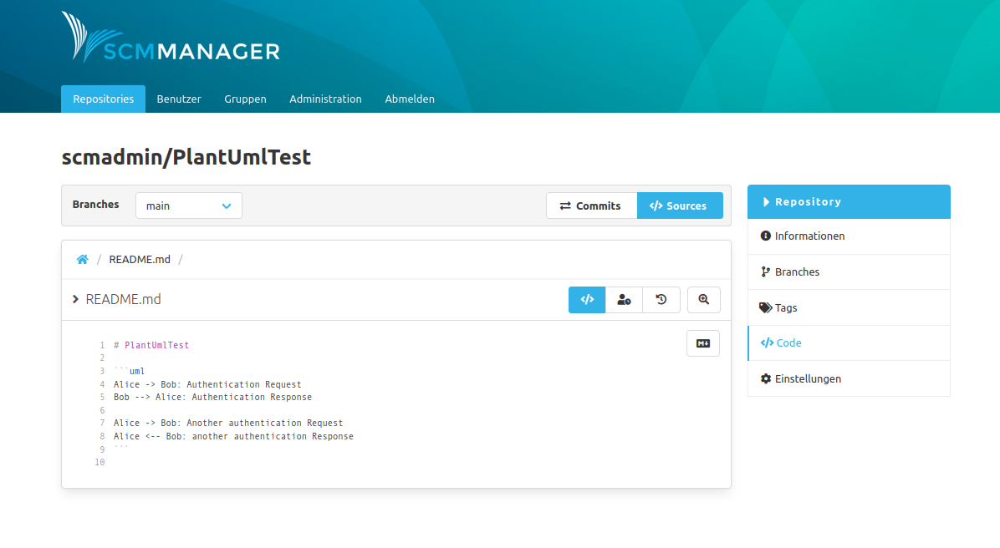

Um ein [PlantUML](plantuml.com/) Diagramm anzeigen zu lassen, muss ein `uml` Codeblock mit validem
PlantUML in einer Markdown-Datei definiert werden.

Sobald der Markdown-Renderer aktiviert ist, wird der Codeblock automatisch mit dem korrekten Diagramm ersetzt.

