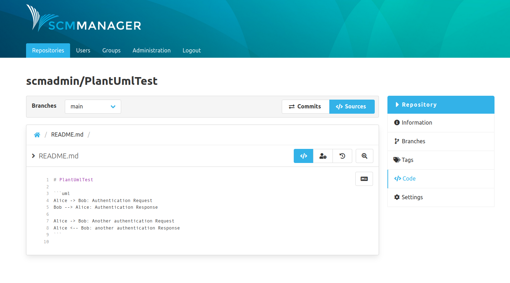
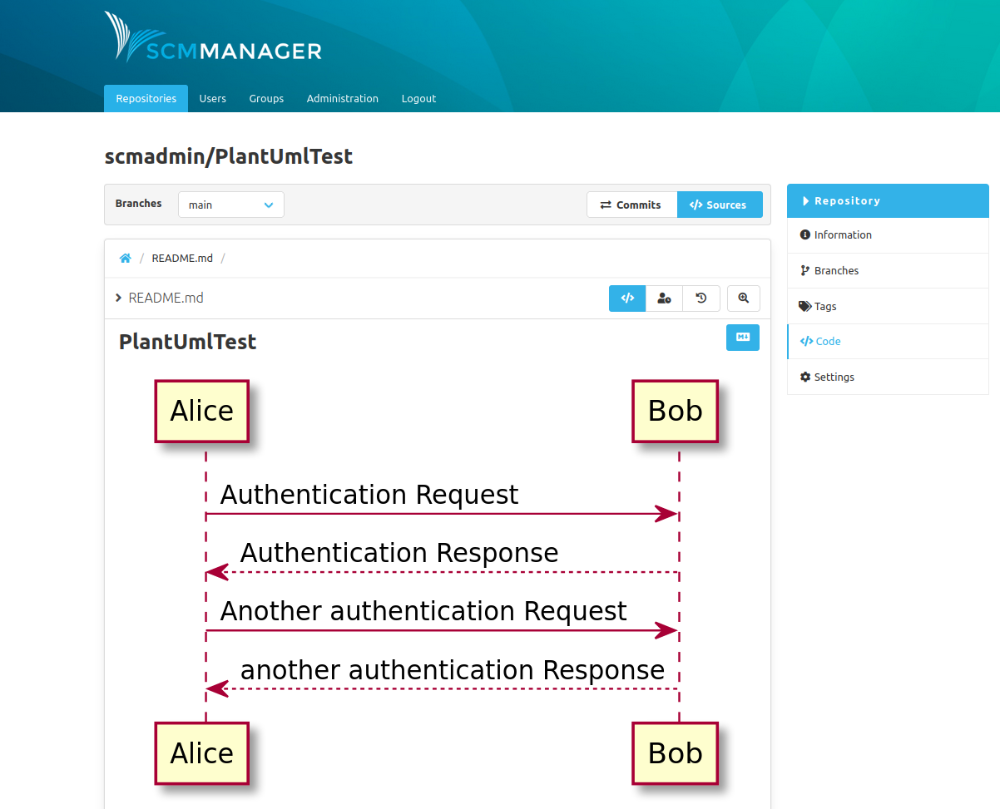

To display a [PlantUML](plantuml.com/) diagram, create a `uml` code block with valid plantuml in the source of a markdown file.

As soon as you activate the markdown renderer the code block is automatically replaced by the correct diagram. 

